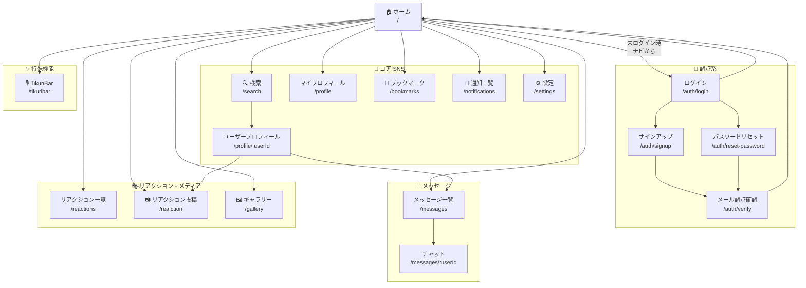
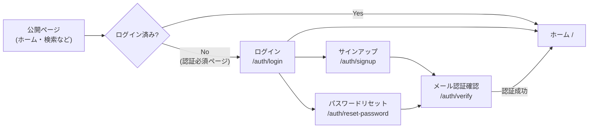
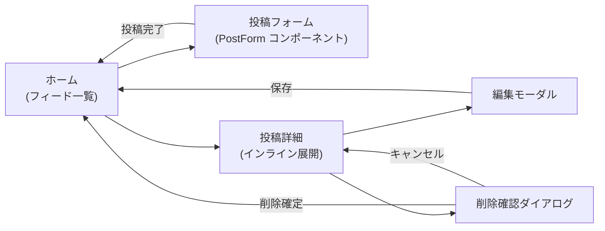
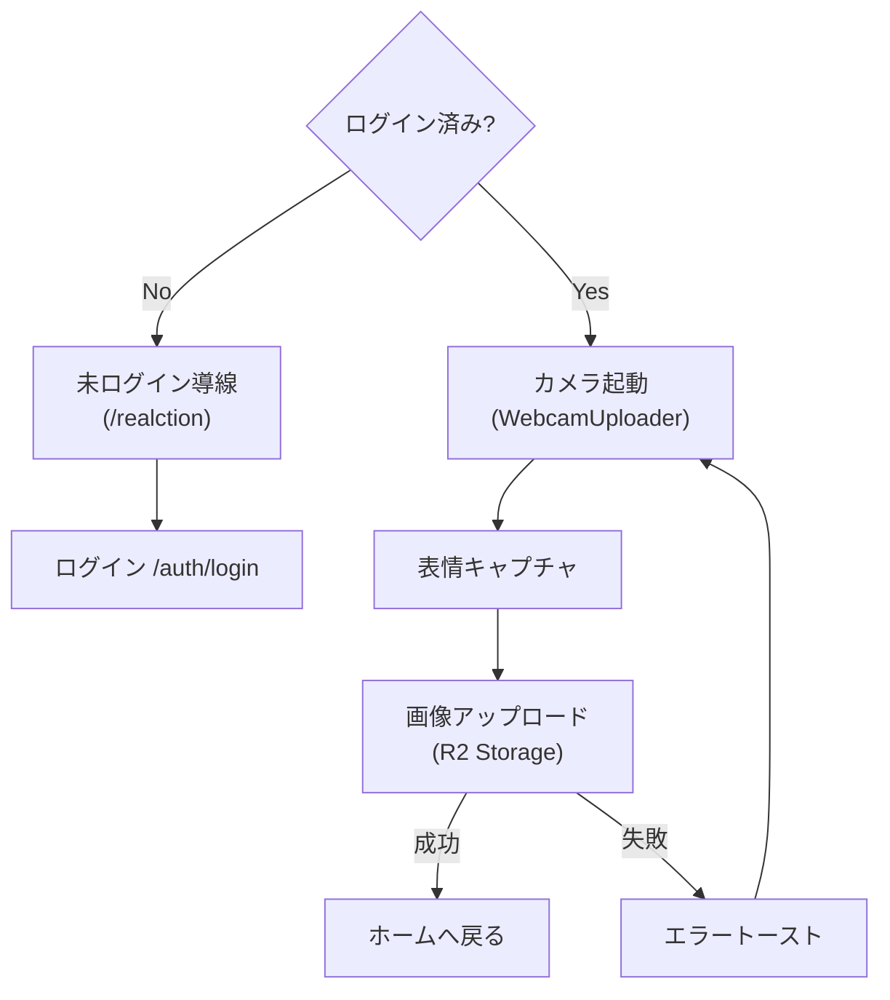
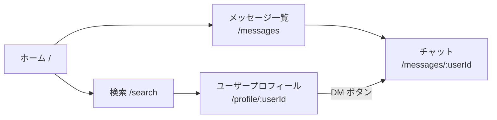
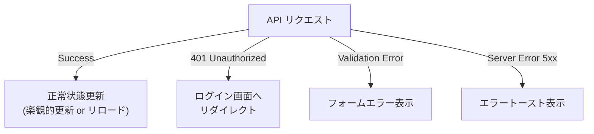

# 🖥️ screen-flow.md テンプレート

---

# 0️⃣ 設計前提

| 項目     | 内容                            |
| ------ | ----------------------------- |
| 対象ユーザー | 一般ユーザー / 管理者 / 未ログイン          |
| デバイス   | Desktop / Mobile / Responsive |
| 認証要否   | 公開ページあり / 全面認証制               |
| 権限制御   | RBAC / ABAC / なし              |
| MVP範囲  | P0画面のみ                        |

---

# 1️⃣ 画面一覧（Screen Inventory）

## 1️⃣ 認証系画面

| ID   | 画面名             | URL                      | 役割                              | 認証  | 優先度 |
| ---- | --------------- | ------------------------ | ------------------------------- | --- | --- |
| S-01 | ログイン            | `/auth/login`            | メール / Google / Twitter 認証      | 不要  | P0  |
| S-02 | サインアップ          | `/auth/signup`           | 新規アカウント登録                       | 不要  | P0  |
| S-03 | メール認証確認         | `/auth/verify`           | サインアップ完了 / パスワードリセットトークン確認      | 不要  | P0  |
| S-04 | パスワードリセット       | `/auth/reset-password`   | 新しいパスワードの設定                     | 不要  | P1  |

---

## 2️⃣ コア SNS 画面

| ID   | 画面名             | URL                      | 役割                              | 認証  | 優先度 |
| ---- | --------------- | ------------------------ | ------------------------------- | --- | --- |
| S-05 | ホーム（メインフィード）    | `/`                      | 投稿一覧・投稿作成・楽観的更新                 | 任意  | P0  |
| S-06 | 検索              | `/search`                | ユーザー・投稿のキーワード検索                 | 任意  | P0  |
| S-07 | マイプロフィール        | `/profile`               | 自身のプロフィール閲覧・アイコン編集              | 必須  | P0  |
| S-08 | ユーザープロフィール      | `/profile/[userId]`      | 他ユーザーのプロフィール閲覧                  | 必須  | P0  |
| S-09 | ブックマーク          | `/bookmarks`             | 保存した投稿の一覧                       | 必須  | P1  |
| S-10 | 通知一覧            | `/notifications`         | いいね・フォロー・返信通知の確認・既読管理           | 必須  | P1  |
| S-11 | 設定              | `/settings`              | アカウント設定・プッシュ通知設定                | 必須  | P1  |

---

## 3️⃣ メッセージ画面

| ID   | 画面名             | URL                      | 役割                              | 認証  | 優先度 |
| ---- | --------------- | ------------------------ | ------------------------------- | --- | --- |
| S-12 | メッセージ一覧         | `/messages`              | DM 相手のユーザー一覧・検索                 | 必須  | P1  |
| S-13 | チャット            | `/messages/[userId]`     | 1 対 1 ダイレクトメッセージ                 | 必須  | P1  |

---

## 4️⃣ リアクション / メディア画面

| ID   | 画面名             | URL                      | 役割                              | 認証  | 優先度 |
| ---- | --------------- | ------------------------ | ------------------------------- | --- | --- |
| S-14 | リアクション一覧        | `/reactions`             | スタンプ・絵文字リアクションの一覧               | 任意  | P1  |
| S-15 | リアクション投稿        | `/realction`             | Webカメラで表情キャプチャ → スタンプ投稿         | 必須  | P1  |
| S-16 | ギャラリー           | `/gallery`               | 投稿に含まれる画像の一覧閲覧                  | 任意  | P2  |

---

## 5️⃣ 特殊機能画面

| ID   | 画面名             | URL                      | 役割                              | 認証  | 優先度 |
| ---- | --------------- | ------------------------ | ------------------------------- | --- | --- |
| S-19 | TikuriBar（音声通話） | `/tikuribar`             | WebSocket / WebRTC リアルタイム音声通話ルーム | 必須  | P2  |

---

## 凡例

| 項目 | 値         | 説明                         |
| -- | --------- | -------------------------- |
| 認証 | **必須**    | `ProtectedRoute` または認証チェック必須・未認証時はログイン画面へリダイレクト |
| 認証 | **任意**    | 未ログインでも閲覧可能・一部機能のみ認証が必要    |
| 認証 | **不要**    | 認証不要（認証済み時は一部リダイレクトあり）     |
| 優先度 | **P0**   | MVP 必須（ローンチに不可欠）           |
| 優先度 | **P1**   | 初期リリース推奨（コア機能補完）           |
| 優先度 | **P2**   | 拡張機能（後続スプリント）              |


---

## 0️⃣ 設計前提

| 項目       | 内容                                                      |
| -------- | ------------------------------------------------------- |
| 対象ユーザー   | 未ログインユーザー / ログイン済みユーザー                                  |
| デバイス     | Desktop（Sidebar ナビ） / Mobile（Bottom Nav）                |
| 認証要否     | 公開ページあり（ホーム・検索・ギャラリー・天気など） / 一部機能は認証必須                  |
| 権限制御     | なし（全員同一権限）                                              |
| MVP 範囲   | P0 画面（認証系 + ホーム + 検索 + プロフィール）                          |
| 認証基盤     | Supabase Auth（メール / Google / Twitter）                   |

---

## 2️⃣ 全体遷移図（高レベル）



---

## 3️⃣ 認証フロー



---

## 4️⃣ 投稿 CRUD 遷移



---

## 5️⃣ リアクション投稿フロー（Webカメラ）



---

## 6️⃣ DM（ダイレクトメッセージ）フロー



---

## 7️⃣ エラーフロー



---

## 8️⃣ モバイル考慮

| 項目        | Desktop            | Mobile                  |
| --------- | ------------------ | ----------------------- |
| ナビゲーション   | Sidebar（左固定）       | Bottom Nav              |
| 拡張ナビ      | Sidebar 内に全メニュー     | MobileExtendedNavigation |
| 投稿フォーム    | ページ内インライン          | フルスクリーン展開               |
| チャット      | 通常ページ              | フルスクリーン                 |
| カメラ（リアクション）| モーダル内              | フルスクリーン                 |

---

## 9️⃣ URL 設計

```
/                          ← ホーム（フィード）
/auth/login                ← ログイン
/auth/signup               ← サインアップ
/auth/verify               ← メール認証確認
/auth/reset-password       ← パスワードリセット
/search                    ← 検索
/profile                   ← マイプロフィール
/profile/:userId           ← ユーザープロフィール
/bookmarks                 ← ブックマーク
/notifications             ← 通知一覧
/settings                  ← 設定
/messages                  ← メッセージ一覧
/messages/:userId          ← チャット
/reactions                 ← リアクション一覧
/realction                 ← リアクション投稿（Webカメラ）
/gallery                   ← ギャラリー
/tikuribar                 ← TikuriBar 音声通話
```