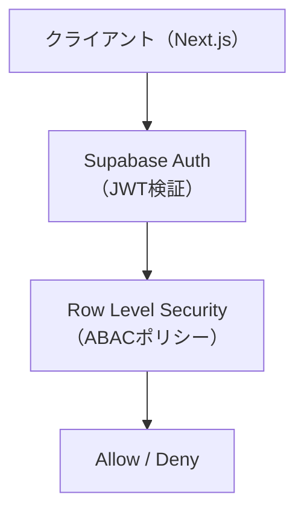

# 🔐 権限設計

---

# 0️⃣ 設計前提

| 項目      | 内容                                           |
| ------- | -------------------------------------------- |
| 権限モデル   | ABAC（Supabase RLS ポリシー中心）                    |
| マルチテナント | なし（シングルテナント SNS）                             |
| 認証方式    | JWT（Supabase Auth）                           |
| スコープ単位  | Resource（各テーブル行単位）                           |
| MVP方針   | 認証済み / 未認証の2ロールのみ。所有者制御は RLS で一元管理           |

---

# 1️⃣ 用語定義

| 用語       | 意味                                                     |
| -------- | ------------------------------------------------------ |
| Subject  | 操作主体（認証済みユーザー `auth.uid()` / 未認証ゲスト）                  |
| Resource | 操作対象（todos / usels / likes / messages 等の各テーブル行）        |
| Action   | 操作内容（SELECT / INSERT / UPDATE / DELETE）                |
| Role     | GUEST（未認証）/ MEMBER（認証済み）                              |
| Policy   | Supabase RLS ポリシー（`USING` / `WITH CHECK` 句で条件を定義）     |

---

# 2️⃣ 権限レイヤー構造



---

# 3️⃣ RBAC設計

## 3-1. グローバルロール

| ロール名   | レベル | 説明                              |
| ------ | --- | ------------------------------- |
| MEMBER | 50  | 認証済みユーザー。投稿・いいね・フォロー等すべての一般操作可能 |
| GUEST  | 10  | 未認証。公開データの読み取りのみ可能             |

> ℹ️ MVP では SUPER_ADMIN / ADMIN ロールは未実装。  
> Supabase Dashboard での直接操作（service_role key）が管理者操作に相当する。

---

## 3-2. スコープロール

マルチテナントなし・組織機能なし。スコープロールは現時点で不採用。

---

## 3-3. RBAC 判定ロジック（抽象）

```pseudo
if auth.uid() IS NOT NULL:
    role = MEMBER  → 続けてABAC評価
else:
    role = GUEST   → SELECT のみ許可（公開テーブルに限る）
```

---

# 4️⃣ ABAC設計（Supabase RLS）

## 4-1. 条件モデル

```json
{
  "subject.uid": "auth.uid()",
  "resource.user_id": "行のuser_idカラム",
  "resource.sender_id": "行のsender_idカラム（messages）",
  "resource.receiver_id": "行のreceiver_idカラム（messages）",
  "match_condition": "auth.uid() = resource.user_id"
}
```

---

## 4-2. ポリシーテーブル（全テーブル対応表）

| テーブル                  | SELECT                                                | INSERT                        | UPDATE                        | DELETE                        |
| --------------------- | ----------------------------------------------------- | ----------------------------- | ----------------------------- | ----------------------------- |
| usels                 | `true`（全公開）                                          | `auth.uid() = user_id`        | `auth.uid() = user_id`        | —                             |
| todos                 | `true`（全公開）                                          | `auth.uid() = user_id`        | `auth.uid() = user_id`        | `auth.uid() = user_id`        |
| likes                 | `true`（全公開）                                          | `auth.uid() = user_id`        | `auth.uid() = user_id`        | `auth.uid() = user_id`        |
| bookmarks             | `auth.uid() = user_id`（自分のみ）                         | `auth.uid() = user_id`        | `auth.uid() = user_id`        | `auth.uid() = user_id`        |
| replies               | `true`（全公開）                                          | `auth.uid() = user_id`        | —                             | `auth.uid() = user_id`        |
| stamp                 | `true`（全公開）                                          | `auth.uid() = user_id`        | —                             | `auth.uid() = user_id`        |
| make_stamp            | `true`（全公開）                                          | `auth.uid() IS NOT NULL`      | —                             | —                             |
| follows               | `true`（全公開）                                          | `auth.uid() = follower_id`    | —                             | `auth.uid() = follower_id`    |
| messages              | `auth.uid() = sender_id OR auth.uid() = receiver_id` | `auth.uid() = sender_id`      | —                             | `auth.uid() = sender_id`      |
| notifications         | `auth.uid() = user_id`（自分のみ）                         | `true`（システムから全ユーザーに通知INSERT可） | `auth.uid() = user_id`        | `auth.uid() = user_id`        |
| push_subscriptions    | `auth.uid() = user_id`（自分のみ）                         | `auth.uid() = user_id`        | `auth.uid() = user_id`        | `auth.uid() = user_id`        |
| notification_settings | `auth.uid() = user_id`（自分のみ）                         | `auth.uid() = user_id`        | `auth.uid() = user_id`        | —                             |
| weather               | `true`（全公開）                                          | `auth.uid() = user_id`        | `auth.uid() = user_id`        | `auth.uid() = user_id`        |
| realction             | `true`（全公開）                                          | `auth.uid() IS NOT NULL`      | —                             | —                             |
| security_logs         | サービスロールのみ                                        | サービスロールのみ                   | サービスロールのみ                   | —                             |
| infrastructure_logs   | サービスロールのみ                                        | サービスロールのみ                   | サービスロールのみ                   | —                             |

---

## 4-3. 判定順序

```pseudo
1. JWT検証（Supabase Authが自動実施）
2. auth.uid() の取得
3. RLS USING句評価（SELECT / UPDATE / DELETE）
4. RLS WITH CHECK句評価（INSERT / UPDATE）
5. 最終 Allow / Deny
```

---

# 5️⃣ ハイブリッド設計パターン

| レイヤー           | 用途                                            |
| -------------- | --------------------------------------------- |
| RBAC           | 認証済み / 未認証の大枠制御                               |
| ABAC（RLS）      | 所有者・送受信者・NULL チェックなど行単位の動的条件                  |
| Feature Flag   | 未実装（今後 isBunkatsu フラグ等を活用したコンテンツ分岐に応用可）       |

---

# 6️⃣ 代表的ルール

### 6-1. 所有者のみ編集・削除可（todos / usels / weather 等）

```pseudo
if resource.user_id == auth.uid():
    allow UPDATE / DELETE
```

---

### 6-2. 自分のブックマーク・通知設定のみ閲覧可

```pseudo
if resource.user_id == auth.uid():
    allow SELECT
else:
    deny
```

---

### 6-3. メッセージは送受信者のみ閲覧可

```pseudo
if resource.sender_id == auth.uid() OR resource.receiver_id == auth.uid():
    allow SELECT
```

---

### 6-4. 認証済みであれば誰でも INSERT 可（make_stamp / realction）

```pseudo
if auth.uid() IS NOT NULL:
    allow INSERT
```

---

### 6-5. 通知はシステムが全ユーザー向けに INSERT 可

```pseudo
-- notifications INSERT: WITH CHECK (true)
-- つまり認証不問でINSERT可能（APIルートから server-side で実行）
allow INSERT unconditionally
```

> ⚠️ notifications の INSERT ポリシーが `true` のため、  
> APIルート（`/api/send-notification`）では必ず **service_role key** を使用し、  
> クライアントから直接 INSERT できないよう Next.js API Route で保護すること。

---

# 7️⃣ データモデル連携

| ルール       | 参照カラム                                              |
| --------- | -------------------------------------------------- |
| 所有者制御     | todos.user_id / usels.user_id / weather.user_id 等 |
| 送受信者制御    | messages.sender_id / messages.receiver_id          |
| フォロー関係制御  | follows.follower_id                                |
| 自分データのみ表示 | bookmarks.user_id / notifications.user_id          |
| 認証済み判定    | `auth.uid() IS NOT NULL`（make_stamp / realction）   |

---

# 8️⃣ ログ設計

## 8-1. ABAC評価ログ（将来拡張）

| フィールド         | 内容                                            |
| ------------- | --------------------------------------------- |
| user_id       | `auth.uid()`                                  |
| action        | SELECT / INSERT / UPDATE / DELETE             |
| resource_type | テーブル名（todos / messages 等）                    |
| resource_id   | 対象行のUUID                                      |
| matched_policy| ポリシー名（例: `todos_delete`）                      |
| result        | allow / deny                                  |
| timestamp     | `NOW()`                                       |

> ℹ️ 現時点では Supabase の Audit Log（Dashboard > Logs）で代替。  
> 将来的にカスタム audit_logs テーブルへの記録を検討。

---

## 8-2. 監査ログ

| フィールド  | 内容                             |
| ------ | ------------------------------ |
| who    | auth.uid()（UUID）               |
| what   | INSERT / UPDATE / DELETE       |
| where  | テーブル名 + 行 ID                  |
| result | allow / deny（RLS通過 / 拒否）       |
| ip     | Next.js APIルートのリクエストヘッダーから取得可能 |

---

# 9️⃣ APIレイヤー統合

```typescript
// Next.js API Route での認証・認可チェック例
// src/app/api/upload/route.ts 等で実施

import { createClient } from '@/utils/supabase/server'

export async function POST(request: Request) {
  const supabase = createClient()

  // 1. JWT検証 → ユーザー取得
  const { data: { user }, error } = await supabase.auth.getUser()
  if (!user || error) return new Response('Unauthorized', { status: 401 })

  // 2. RLSがDBレイヤーで所有者チェックを自動実施
  //    → auth.uid() = user_id を満たさない行は操作不可

  // 3. 通知送信など特権操作は service_role client を使用
  //    （クライアントには公開しない）
}
```

---

# 🔟 フロントエンド制御

| パターン | 実装箇所                                | 説明                                       |
| ---- | ----------------------------------- | ---------------------------------------- |
| 非表示  | `ProtectedRoute` コンポーネント            | 未認証ユーザーを `/auth/login` にリダイレクト。対象UIを非表示 |
| 非表示  | `user.id === post.user_id` の条件分岐    | 自分の投稿のみ削除ボタンを表示                          |
| 無効化  | ローディング中は `disabled` 属性付与            | 二重送信防止                                   |
| 警告   | トースト / エラーメッセージ                     | RLS エラー（403相当）をUIに表示                     |

> ⚠️ フロントエンドの表示制御はUX目的のみ。  
> **最終的な権限判定は必ず Supabase RLS（サーバー側）で実施する。**
