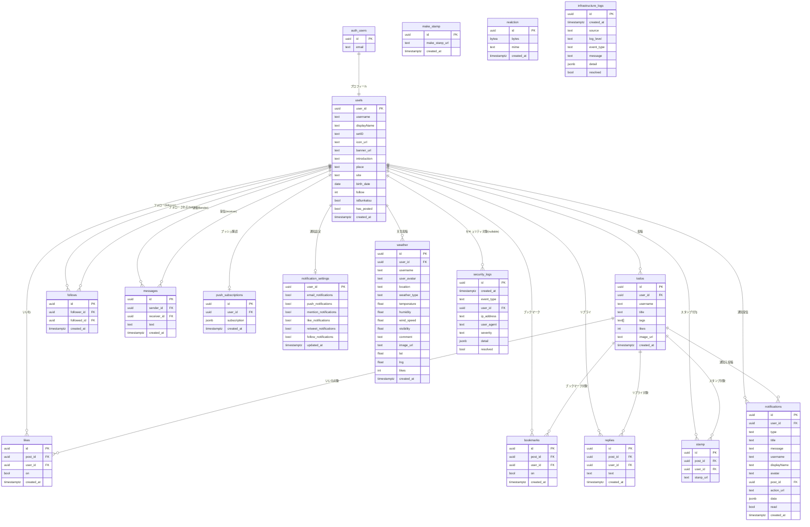

# 🗄️ じょぎSNS DB設計書

---

# 0️⃣ 設計観点

| 項目      | 内容                                                               |
| ------- | ---------------------------------------------------------------- |
| 権限モデル   | ABAC（Supabase RLS / Row Level Security）                          |
| ID戦略    | UUID（`gen_random_uuid()`）、ユーザーは `auth.users.id` と 1:1 紐付け      |
| 論理削除    | 無（`ON DELETE CASCADE` による物理削除）                                   |
| 監査ログ    | 任意（`created_at` のみ記録。操作ログは未実装）                                   |
| 認証基盤    | Supabase Auth（Twitter/X OAuth）。`auth.users` はSupabase管理テーブル       |
| ストレージ   | 画像は Cloudflare R2、スタンプ画像URL のみDB管理|   |
| リアルタイム  | `supabase_realtime` パブリケーションで `todos`/`likes`/`replies`等を配信      |

---

# 1️⃣ テーブル一覧

| ドメイン   | テーブル名                   | 役割               | Phase |
| ------ | ----------------------- | ---------------- | ----- |
| アカウント  | usels                   | ユーザープロフィール       | P0    |
| ソーシャル  | follows                 | フォロー関係           | P0    |
| コア投稿   | todos                   | 投稿      | P0    |
| コア投稿   | likes                   | いいね              | P0    |
| コア投稿   | replies                 | リプライ（ネスト）        | P0    |
| コア投稿   | bookmarks               | ブックマーク           | P0    |
| リアクション | stamp                   | スタンプリアクションのpush記録       | P1    |
| リアクション | make_stamp              | ユーザースタンプ作成  | P1    |
| メッセージ  | messages                | ダイレクトメッセージ       | P1    |
| 通知     | notifications           | 通知管理             | P1    |
| 通知     | push_subscriptions      | Webプッシュ購読情報      | P1    |
| 通知     | notification_settings   | 通知設定             | P1    |
| 特殊投稿   | weather                 | おすすめ投稿フォーム     | P1    |
| 特殊投稿   | realction               | REALctionバイナリ画像(test用)  | P2    |
| ログ     | security_logs           | セキュリティイベントログ      | P1    |
| ログ     | infrastructure_logs     | インフラ監視ログ             | P1    |

---

# 2️⃣ ERD



---

# 3️⃣ カラム定義

## usels（ユーザープロフィール）

> `auth.users` と 1:1 対応。Supabase Auth が生成した UUID を PK として共有。

| カラム          | 型           | 制約                        | 説明                           |
| ------------ | ----------- | ------------------------- | ---------------------------- |
| user_id      | UUID        | PK, FK → auth.users(id)   | Supabase Auth UID と同一        |
| username     | TEXT        | UNIQUE NOT NULL            | @ユーザー名                       |
| displayName  | TEXT        | —                         | 表示名                          |
| setID        | TEXT        | —                         | カスタムID（任意）                   |
| icon_url     | TEXT        | —                         | アイコン画像URL（Cloudflare R2）      |
| banner_url   | TEXT        | —                         | バナー画像URL                      |
| introduction | TEXT        | —                         | 自己紹介                         |
| place        | TEXT        | —                         | 居住地                          |
| site         | TEXT        | —                         | Webサイト URL                   |
| birth_date   | DATE        | —                         | 生年月日                         |
| follow       | INTEGER     | DEFAULT 0                 | フォロー数（非正規化カウンタ）              |
| isBunkatsu   | BOOLEAN     | DEFAULT FALSE             | 分割表示フラグ                      |
| has_posted   | BOOLEAN     | DEFAULT FALSE             | 初回投稿済みフラグ                    |
| created_at   | TIMESTAMPTZ | DEFAULT NOW()              | 作成日時                         |

---

## todos（投稿）

> コア投稿テーブル。24時間後にアプリ層またはバッチで削除。(24時間後に削除機能は削除予定)

| カラム        | 型           | 制約                          | 説明                     |
| ---------- | ----------- | --------------------------- | ---------------------- |
| id         | UUID        | PK, DEFAULT gen_random_uuid() | 投稿ID                   |
| user_id    | UUID        | FK → usels(user_id) NOT NULL | 投稿者                    |
| username   | TEXT        | —                           | 非正規化ユーザー名（表示高速化）       |
| title      | TEXT        | NOT NULL                    | 投稿本文                   |
| tags       | TEXT\[\]    | —                           | タグ配列（PostgreSQL Array型） |
| likes      | INTEGER     | DEFAULT 0                   | いいね数（非正規化カウンタ）         |
| image_url  | TEXT        | —                           | 添付画像URL                |
| created_at | TIMESTAMPTZ | DEFAULT NOW()                | 投稿日時          |

---

## likes（いいね）

| カラム        | 型           | 制約                                    | 説明             |
| ---------- | ----------- | ------------------------------------- | -------------- |
| id         | UUID        | PK                                    |                |
| post_id    | UUID        | FK → todos(id) NOT NULL               | 対象投稿           |
| user_id    | UUID        | FK → usels(user_id) NOT NULL          | いいね実行ユーザー      |
| on         | BOOLEAN     | DEFAULT TRUE                          | いいね状態（トグル用）    |
| created_at | TIMESTAMPTZ | DEFAULT NOW()                          | 日時             |
| —          | —           | UNIQUE(post_id, user_id)              | 重複いいね防止        |

---

## bookmarks（ブックマーク）

| カラム        | 型           | 制約                               | 説明              |
| ---------- | ----------- | -------------------------------- | --------------- |
| id         | UUID        | PK                               |                 |
| post_id    | UUID        | FK → todos(id) NOT NULL          | 対象投稿            |
| user_id    | UUID        | FK → usels(user_id) NOT NULL     | ブックマーク実行ユーザー    |
| on         | BOOLEAN     | DEFAULT TRUE                     | ブックマーク状態（トグル用）  |
| created_at | TIMESTAMPTZ | DEFAULT NOW()                     | 日時              |
| —          | —           | UNIQUE(post_id, user_id)         | 重複ブックマーク防止      |

---

## replies（リプライ）

| カラム        | 型           | 制約                           | 説明       |
| ---------- | ----------- | ---------------------------- | -------- |
| id         | UUID        | PK                           |          |
| post_id    | UUID        | FK → todos(id) NOT NULL      | 親投稿      |
| user_id    | UUID        | FK → usels(user_id) NOT NULL | 投稿者      |
| text       | TEXT        | NOT NULL                     | リプライ本文   |
| created_at | TIMESTAMPTZ | DEFAULT NOW()                 | 投稿日時     |

---

## stamp（スタンプリアクション）

> Discord 風カスタムスタンプ。同一投稿に同一スタンプは1回まで。

| カラム       | 型    | 制約                                          | 説明               |
| --------- | ---- | ------------------------------------------- | ---------------- |
| id        | UUID | PK                                          |                  |
| post_id   | UUID | FK → todos(id) NOT NULL                     | 対象投稿             |
| user_id   | UUID | FK → usels(user_id) NOT NULL                | 実行ユーザー           |
| stanp_url | TEXT | NOT NULL                                    | スタンプ画像URL        |
| —         | —    | UNIQUE(post_id, user_id, stanp_url)         | 同一スタンプの重複防止      |

---

## make_stamp（ユーザー作成スタンプ）

> カメラ撮影等で生成した一時スタンプ。24時間TTL。

| カラム            | 型           | 制約            | 説明         |
| -------------- | ----------- | ------------- | ---------- |
| id             | UUID        | PK            |            |
| make_stanp_url | TEXT        | NOT NULL      | スタンプ画像URL  |
| created_at     | TIMESTAMPTZ | DEFAULT NOW() | 作成日時 |

---

## follows（フォロー関係）

| カラム         | 型           | 制約                                       | 説明           |
| ----------- | ----------- | ---------------------------------------- | ------------ |
| id          | UUID        | PK                                       |              |
| follower_id | UUID        | FK → usels(user_id) NOT NULL             | フォローする側       |
| followed_id | UUID        | FK → usels(user_id) NOT NULL             | フォローされる側      |
| created_at  | TIMESTAMPTZ | DEFAULT NOW()                             | フォロー日時       |
| —           | —           | UNIQUE(follower_id, followed_id)         | 重複フォロー防止     |
| —           | —           | CHECK(follower_id <> followed_id)        | 自己フォロー防止     |

---

## messages（ダイレクトメッセージ）

| カラム         | 型           | 制約                           | 説明    |
| ----------- | ----------- | ---------------------------- | ----- |
| id          | UUID        | PK                           |       |
| sender_id   | UUID        | FK → usels(user_id) NOT NULL | 送信者   |
| receiver_id | UUID        | FK → usels(user_id) NOT NULL | 受信者   |
| text        | TEXT        | NOT NULL                     | メッセージ本文 |
| created_at  | TIMESTAMPTZ | DEFAULT NOW()                 | 送信日時  |

---

## notifications（通知）

| カラム         | 型           | 制約                                                                    | 説明                                      |
| ----------- | ----------- | --------------------------------------------------------------------- | --------------------------------------- |
| id          | UUID        | PK                                                                    |                                         |
| user_id     | UUID        | FK → usels(user_id) NOT NULL                                          | 通知受信ユーザー                                |
| type        | TEXT        | NOT NULL CHECK IN ('like','follow','mention','reply','bookmark','system') | 通知種別                                    |
| title       | TEXT        | —                                                                     | 通知タイトル                                  |
| message     | TEXT        | —                                                                     | 通知本文                                    |
| username    | TEXT        | —                                                                     | 通知元ユーザー名（非正規化）                          |
| displayName | TEXT        | —                                                                     | 表示名（非正規化）                               |
| avatar      | TEXT        | —                                                                     | アイコンURL（非正規化）                           |
| post_id     | UUID        | FK → todos(id) ON DELETE SET NULL                                     | 関連投稿（削除時NULLに）                          |
| action_url  | TEXT        | —                                                                     | 遷移先URL                                  |
| data        | JSONB       | —                                                                     | 拡張データ                                   |
| read        | BOOLEAN     | DEFAULT FALSE                                                         | 既読フラグ                                   |
| created_at  | TIMESTAMPTZ | DEFAULT NOW()                                                          | 通知日時                                    |

---

## push_subscriptions（Webプッシュ購読）

| カラム          | 型           | 制約                           | 説明                  |
| ------------ | ----------- | ---------------------------- | ------------------- |
| id           | UUID        | PK                           |                     |
| user_id      | UUID        | FK → usels(user_id) UNIQUE   | 1ユーザー1購読（最新デバイス）    |
| subscription | JSONB       | NOT NULL                     | Web Push API購読オブジェクト |
| created_at   | TIMESTAMPTZ | DEFAULT NOW()                 | 登録日時                |

---

## notification_settings（通知設定）

| カラム                    | 型           | 制約                           | 説明             |
| ---------------------- | ----------- | ---------------------------- | -------------- |
| user_id                | UUID        | PK, FK → usels(user_id)      |                |
| email_notifications    | BOOLEAN     | DEFAULT TRUE                 | メール通知          |
| push_notifications     | BOOLEAN     | DEFAULT TRUE                 | プッシュ通知         |
| mention_notifications  | BOOLEAN     | DEFAULT TRUE                 | メンション通知        |
| like_notifications     | BOOLEAN     | DEFAULT TRUE                 | いいね通知          |
| retweet_notifications  | BOOLEAN     | DEFAULT TRUE                 | リツイート通知        |
| follow_notifications   | BOOLEAN     | DEFAULT TRUE                 | フォロー通知         |
| updated_at             | TIMESTAMPTZ | DEFAULT NOW()                 | 最終更新日時         |

---

## weather（おすすめの場所投稿機能）

| カラム         | 型           | 制約                                                                  | 説明                               |
| ----------- | ----------- | ------------------------------------------------------------------- | -------------------------------- |
| id          | UUID        | PK                                                                  |                                  |
| user_id     | UUID        | FK → usels(user_id) NOT NULL                                        | 投稿者                              |
| username    | TEXT        | —                                                                   | ユーザー名（非正規化）                      |
| user_avatar | TEXT        | —                                                                   | アイコンURL（非正規化）                    |
| location    | TEXT        | NOT NULL                                                            | 地名                               |          |                           |
| comment     | TEXT        | —                                                                   | コメント                             |
| image_url   | TEXT        | —                                                                   | 添付画像URL                          |
| lat         | FLOAT       | —                                                                   | 緯度（Google Maps連携）                |
| lng         | FLOAT       | —                                                                   | 経度（Google Maps連携）                |
| likes       | INTEGER     | DEFAULT 0                                                           | いいね数（非正規化カウンタ）                   |
| created_at  | TIMESTAMPTZ | DEFAULT NOW()                                                        | 投稿日時                             |
---
## security_logs（セキュリティログ）

> 不正ログイン・不審なアクセス等のセキュリティイベントを記録するテーブル。

| カラム        | 型           | 制約                                                                 | 説明                                      |
| ----------- | ----------- | -------------------------------------------------------------------- | ----------------------------------------- |
| id          | UUID        | PK, DEFAULT gen_random_uuid()                                        | ログID                                    |
| created_at  | TIMESTAMPTZ | NOT NULL, DEFAULT NOW()                                              | 検知日時                                  |
| event_type  | TEXT        | NOT NULL CHECK IN ('unauthorized_login','brute_force','account_lock','suspicious_access','token_abuse') | イベント種別 |
| user_id     | UUID        | FK → usels(user_id) ON DELETE SET NULL, NULLABLE                    | 対象ユーザー（特定できない場合はNULL）       |
| ip_address  | TEXT        | NOT NULL                                                             | アクセス元IPアドレス                        |
| user_agent  | TEXT        | —                                                                    | ブラウザ / デバイス情報                     |
| severity    | TEXT        | NOT NULL CHECK IN ('low','medium','high','critical')                 | 重要度                                    |
| detail      | JSONB       | —                                                                    | 追加情報（試行回数・エラー内容等）            |
| resolved    | BOOLEAN     | DEFAULT FALSE                                                        | 対応済みフラグ                             |

---

## infrastructure_logs（インフラログ）

> Raspberry Pi・Supabase・Cloudflare R2 等のシステムエラーや警告を記録するテーブル。

| カラム        | 型           | 制約                                                                 | 説明                                      |
| ----------- | ----------- | -------------------------------------------------------------------- | ----------------------------------------- |
| id          | UUID        | PK, DEFAULT gen_random_uuid()                                        | ログID                                    |
| created_at  | TIMESTAMPTZ | NOT NULL, DEFAULT NOW()                                              | 発生日時                                  |
| source      | TEXT        | NOT NULL CHECK IN ('raspberry_pi','supabase','r2','vercel')          | ログの発生源                               |
| log_level   | TEXT        | NOT NULL CHECK IN ('info','warn','error')                            | ログレベル                                |
| event_type  | TEXT        | NOT NULL                                                             | イベント種別（例: `r2_storage_limit`, `supabase_connection_error`） |
| message     | TEXT        | NOT NULL                                                             | ログメッセージ本文                          |
| detail      | JSONB       | —                                                                    | 追加情報（スタックトレース・使用量等）        |
| resolved    | BOOLEAN     | DEFAULT FALSE                                                        | 対応済みフラグ                             |

## realction（REALctionバイナリ画像）

> カメラリアクション画像をバイナリで直接格納（小規模・一時利用を想定）。

| カラム        | 型           | 制約            | 説明           |
| ---------- | ----------- | ------------- | ------------ |
| id         | UUID        | PK            |              |
| bytes      | BYTEA       | NOT NULL      | 画像バイナリデータ    |
| mime       | TEXT        | NOT NULL      | MIMEタイプ      |
| created_at | TIMESTAMPTZ | DEFAULT NOW() | 作成日時         |

---

# 4️⃣ 権限設計（RLS）

## 権限モデル：ABAC（Supabase Row Level Security）

認証ユーザーの `auth.uid()` とレコードの `user_id` を照合することで
「自分のデータは自分だけが変更できる」原則を実装。

## ポリシー一覧

| テーブル                  | SELECT              | INSERT                         | UPDATE                    | DELETE                    |
| --------------------- | ------------------- | ------------------------------ | ------------------------- | ------------------------- |
| usels                 | 全員                  | `auth.uid() = user_id`         | `auth.uid() = user_id`    | —                         |
| todos                 | 全員                  | `auth.uid() = user_id`         | `auth.uid() = user_id`    | `auth.uid() = user_id`    |
| likes                 | 全員                  | `auth.uid() = user_id`         | `auth.uid() = user_id`    | `auth.uid() = user_id`    |
| bookmarks             | `auth.uid() = user_id` | `auth.uid() = user_id`      | `auth.uid() = user_id`    | `auth.uid() = user_id`    |
| replies               | 全員                  | `auth.uid() = user_id`         | —                         | `auth.uid() = user_id`    |
| stamp                 | 全員                  | `auth.uid() = user_id`         | —                         | `auth.uid() = user_id`    |
| make_stamp            | 全員                  | 認証済みユーザー                       | —                         | —                         |
| follows               | 全員                  | `auth.uid() = follower_id`     | —                         | `auth.uid() = follower_id` |
| messages              | sender or receiver  | `auth.uid() = sender_id`       | —                         | `auth.uid() = sender_id`  |
| notifications         | `auth.uid() = user_id` | 全員（サーバーサイドが挿入）             | `auth.uid() = user_id`    | `auth.uid() = user_id`    |
| push_subscriptions    | `auth.uid() = user_id` | `auth.uid() = user_id`      | `auth.uid() = user_id`    | `auth.uid() = user_id`    |
| notification_settings | `auth.uid() = user_id` | `auth.uid() = user_id`      | `auth.uid() = user_id`    | —                         |
| weather               | 全員                  | `auth.uid() = user_id`         | `auth.uid() = user_id`    | `auth.uid() = user_id`    |
| realction             | 全員                  | 認証済みユーザー                       | —                         | —                         |
| security_logs         | サービスロールのみ           | サービスロールのみ                      | サービスロールのみ                 | —                         |
| infrastructure_logs   | サービスロールのみ           | サービスロールのみ                      | サービスロールのみ                 | —                         |

---

# 5️⃣ インデックス設計

```sql
-- todos（タイムラインの主要クエリ）
CREATE INDEX todos_user_id_idx    ON public.todos(user_id);
CREATE INDEX todos_created_at_idx ON public.todos(created_at DESC);

-- replies
CREATE INDEX replies_post_id_idx ON public.replies(post_id);

-- messages（会話スレッド取得）
CREATE INDEX messages_sender_receiver_idx ON public.messages(sender_id, receiver_id);
CREATE INDEX messages_created_at_idx      ON public.messages(created_at ASC);

-- notifications
CREATE INDEX notifications_user_id_idx    ON public.notifications(user_id);
CREATE INDEX notifications_created_at_idx ON public.notifications(created_at DESC);

-- weather
CREATE INDEX weather_created_at_idx ON public.weather(created_at DESC);

-- make_stamp（TTLクリーニング用）
CREATE INDEX make_stamp_created_at_idx ON public.make_stamp(created_at DESC);
```

---

# 6️⃣ リアルタイム設計（Supabase Realtime）

```sql
ALTER PUBLICATION supabase_realtime ADD TABLE public.todos;
ALTER PUBLICATION supabase_realtime ADD TABLE public.replies;
ALTER PUBLICATION supabase_realtime ADD TABLE public.likes;
ALTER PUBLICATION supabase_realtime ADD TABLE public.stamp;
ALTER PUBLICATION supabase_realtime ADD TABLE public.notifications;
ALTER PUBLICATION supabase_realtime ADD TABLE public.messages;
ALTER PUBLICATION supabase_realtime ADD TABLE public.weather;
```

| テーブル          | 用途                    |
| ------------- | --------------------- |
| todos         | ホームフィードのリアルタイム更新      |
| replies       | リプライのリアルタイム追加         |
| likes         | いいね数のリアルタイム反映         |
| stamp         | スタンプリアクションのリアルタイム表示   |
| notifications | 通知バッジのリアルタイム更新        |
| messages      | DM のリアルタイム受信          |
| weather       | 天気マップのリアルタイム更新        |

---

# 7️⃣ TTL（24時間自動削除）設計(24時間で自動削除機能は削除予定)

## 対象テーブル

| テーブル       | TTL条件                                  | 実装方針                    |
| ---------- | --------------------------------------- | ----------------------- |
| todos      | `created_at < NOW() - INTERVAL '24h'`  | Supabase Edge Functions (cron) or pg_cron |
| make_stamp | `created_at < NOW() - INTERVAL '24h'`  | 同上                      |