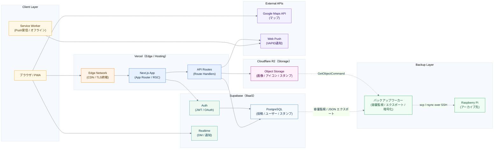

# 🏗️ インフラ構成

---

# 0️⃣ 構成前提

| 項目         | 内容                              |
| ---------- | ------------------------------- |
| ホスティング     | Vercel（Next.js）                  |
| BaaS       | Supabase（DB / Auth / Realtime）   |
| オブジェクトストレージ | Cloudflare R2                   |
| 地図         | Google Maps API                 |
| プッシュ通知     | Web Push（VAPID）                  |
| リアルタイム通信   | WebSocket（ws）/ Supabase Realtime |
| アーカイブ先     | Raspberry Pi（ローカルストレージ）         |

---

# 1️⃣ システム全体構成



---

# 2️⃣ 各レイヤーの詳細

---

## Vercel（ホスティング / Edge）

| 項目       | 内容                                    |
| -------- | ------------------------------------- |
| 役割       | Next.js アプリのホスティング・配信                 |
| CDN      | 静的アセット・画像の自動キャッシュ                     |
| Edge     | TLS終端 / ヘッダー制御 / Service Worker配信     |
| API実行環境  | Route Handlers（Serverless Functions）   |
| 画像最適化    | `next/image`（R2ドメインをホワイトリスト登録済み）      |

設計意図：
- サーバー管理不要でフロントとAPIを一体デプロイ
- `next build --turbopack` によるビルド高速化

---

## Supabase（BaaS）

### Auth

| 項目    | 内容                         |
| ----- | -------------------------- |
| 認証方式  | メール / パスワード認証              |
| セッション | JWT（`@supabase/ssr` でSSR対応） |
| 保護    | `ProtectedRoute` コンポーネントで制御 |

### PostgreSQL

| テーブル系    | 用途               |
| -------- | ---------------- |
| 投稿・ユーザー  | SNSのコアデータ        |
| スタンプ     | カスタムリアクション       |
| DM       | メッセージデータ         |
| 通知       | 通知履歴・既読管理        |
| ブックマーク   | 保存投稿             |

### Realtime

- DM・通知のリアルタイム配信に利用
- Supabase の Postgres Changes / Broadcast を使用

---

## Cloudflare R2（オブジェクトストレージ）

| 項目      | 内容                                        |
| ------- | ----------------------------------------- |
| 用途      | 投稿画像 / アイコン / スタンプ画像の保存                   |
| アクセス方法  | AWS SDK（`@aws-sdk/client-s3`）でS3互換APIを使用  |
| URL配信   | `pub-1d11d6a89cf341e7966602ec50afd166.r2.dev` |
| 署名付きURL | `@aws-sdk/s3-request-presigner` で生成        |

設計意図：
- Vercel の帯域コスト回避のため画像はR2直配信
- S3互換なので既存SDKがそのまま使用可能

---

## 外部API

| API                | 用途             | 使用箇所                    |
| ------------------ | -------------- | ----------------------- |
| Google Maps API    | 投稿の地図表示      | `src/app/weather/`       |
| Web Push（VAPID）   | プッシュ通知送信       | `src/app/api/send-notification/` |

---

## PWA / Service Worker

| 項目        | 内容                              |
| --------- | --------------------------------- |
| マニフェスト    | `public/manifest.json`            |
| Service Worker | `public/sw.js`                |
| プッシュ受信    | Service Worker でバックグラウンド受信      |
| キャッシュ制御   | `Cache-Control: no-cache` で常に最新を配信 |

---

## バックアップワーカー / Raspberry Pi

> DB / R2 の使用容量が閾値を超えた場合のみ起動するサーバーサイドのバックアップ処理。

| 項目          | 内容                                                   |
| ----------- | ---------------------------------------------------- |
| 実行場所        | サーバーサイドスクリプト（Next.js とは独立したワーカー）                     |
| トリガー        | 毎週 cron で容量チェック → `BACKUP_DB_THRESHOLD_PCT` / `BACKUP_R2_THRESHOLD_GB` 超過時のみ起動 |
| DB 抽出       | Supabase JS Client で対象テーブルを SELECT（`created_at` 期間フィルタ付き）→ JSON |
| 画像取得        | `@aws-sdk/client-s3` — `GetObjectCommand` でストリームダウンロード |
| パッケージ化      | `tar -czf` で圧縮                                       |
| 暗号化         | `gpg --symmetric --cipher-algo AES256`               |
| チェックサム      | `sha256sum` で整合性検証ファイル生成                             |
| 転送          | `scp` / `rsync --partial` over SSH で Pi へ送信          |
| アーカイブ後削除    | Pi 側チェックサム検証成功後に Supabase / R2 の対象データを削除して容量解放       |
| 通知          | 成功・失敗を Discord Webhook 等へ通知                          |
| アーカイブ先（Pi） | Raspberry Pi のローカルストレージ（SSH 公開鍵認証）                   |

---

# 3️⃣ データフロー

## 投稿フロー

```
ユーザー
  → PostForm（画像選択）
  → /api/upload（R2に画像保存 → URL取得）
  → Supabase PostgreSQL（投稿レコード保存）
  → ホームページに反映
```

## 認証フロー

```
ユーザー
  → /auth/signup or /auth/login
  → Supabase Auth（JWT発行）
  → ProtectedRoute がセッション確認
  → 初回登録時 → /tutorial へリダイレクト
```

## プッシュ通知フロー

```
いいね / フォロー等のアクション
  → /api/send-like-notification or /api/send-notification
  → web-push（VAPID署名）
  → ブラウザの Service Worker
  → プッシュ通知表示
```

## バックアップ / アーカイブフロー

```
毎週 cron 実行
  → pg_database_size() / R2 List API で使用量取得
  → 閾値未満 → スキップ（次回チェックへ）
  → 閾値超過 → バックアップワーカー起動
      → Supabase から対象テーブルを SELECT → JSON ファイル化
      → R2 から対象画像を GetObjectCommand でダウンロード
      → tar -czf でパッケージ化
      → gpg --symmetric (AES256) で暗号化
      → sha256sum でチェックサム生成
      → scp / rsync over SSH で Raspberry Pi へ転送
      → Pi 側チェックサム検証
      → 検証 OK → Supabase / R2 の対象データ削除（容量解放）
      → 検証 NG → 削除スキップ・エラー通知
      → Discord Webhook で成否を通知
```

---

# 4️⃣ 環境変数一覧（必要なもの）

| 変数名                        | 用途                  |
| -------------------------- | ------------------- |
| `NEXT_PUBLIC_SUPABASE_URL` | Supabase プロジェクトURL  |
| `NEXT_PUBLIC_SUPABASE_ANON_KEY` | Supabase 匿名キー    |
| `SUPABASE_SERVICE_ROLE_KEY` | Supabase サービスロールキー |
| `R2_ACCESS_KEY_ID`         | Cloudflare R2 アクセスキー |
| `R2_SECRET_ACCESS_KEY`     | Cloudflare R2 シークレット |
| `R2_BUCKET_NAME`           | R2 バケット名            |
| `R2_ENDPOINT`              | R2 エンドポイントURL       |
| `GOOGLE_MAPS_API_KEY`      | Google Maps APIキー   |
| `VAPID_PUBLIC_KEY`         | Web Push 公開鍵        |
| `VAPID_PRIVATE_KEY`        | Web Push 秘密鍵        |
| `BACKUP_DB_THRESHOLD_PCT`  | DB 容量監視の閾値（使用率 %） |
| `BACKUP_R2_THRESHOLD_GB`   | R2 容量監視の閾値（GB）    |
| `PI_SSH_HOST`              | Raspberry Pi のホスト名 / IP |
| `PI_SSH_USER`              | Pi への SSH ユーザー名    |
| `PI_BACKUP_PATH`           | Pi 側のバックアップ保存先パス |
| `GPG_PASSPHRASE`           | GPG 対称暗号化パスフレーズ   |

