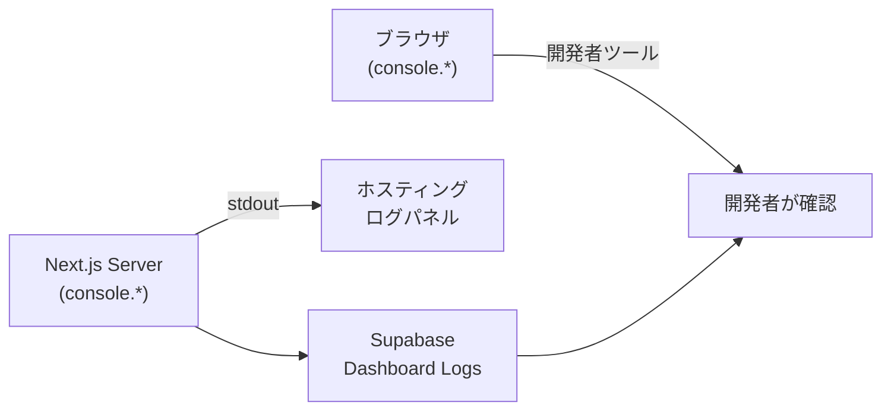

# 📘 ログ設計（現行実装）

> 最終更新: 2026-03-01

---

# 0️⃣ システム概要

| 項目       | 内容                                                  |
| -------- | --------------------------------------------------- |
| プロジェクト名  | ikutio\_allstars（Jyogi SNS）                         |
| フレームワーク  | Next.js 15 App Router（TypeScript）                   |
| バックエンド   | Supabase（PostgreSQL + Auth + Storage + Realtime）    |
| 画像ストレージ  | Cloudflare R2                                       |
| 外部API    |  Map API / Web Push   |
| ログ方式     | `console.*` ベース（非構造化テキスト）＋ 一部 Logger クラス           |
| 集約方式     | **未導入**（Supabase Dashboard Logs で代替）               |
| 個人情報マスキング | **未実装**（今後の課題）                                     |

---

# 1️⃣ 現行ログ分類

| 種別              | 実装状況         | 出力先                        |
| --------------- | ------------ | -------------------------- |
| Application Log | ✅ 実装済み       | `console.*` → Node.js 標準出力 |
| Access Log      | ⚠️ 部分的       | Next.js デフォルトのみ            |
| Audit Log       | ⚠️ 代替運用      | Supabase Dashboard > Logs  |
| Security Log    | ⚠️ 計画中        | `security_logs` テーブル / stdout  |
| Business Log    | ❌ 未実装        | —                          |
| Infrastructure Log | ⚠️ 計画中        | `infrastructure_logs` テーブル / stdout     |
| Backup Log      | ⚠️ 計画中        | バックアップワーカーの stdout / 通知 Webhook |

---

# 2️⃣ ログレベル定義

`src/app/api/news/route.ts` に実装済みの `Logger` クラスが基準。

```typescript
enum LogLevel {
  ERROR = 0,
  WARN  = 1,
  INFO  = 2,
  DEBUG = 3,
}
```

| レベル    | 用途                     | 本番出力 |
| ------ | ---------------------- | ---- |
| ERROR  | 処理失敗（API エラー・DB 書込失敗・インフラ障害等）  | ✅    |
| WARN   | 想定内の異常（API Key 未設定など）  | ✅    |
| INFO   | 正常動作                   | ❌ 無効 |
| DEBUG  | 詳細トレース                 | ❌ 無効 |

> 本番（`NODE_ENV=production`）では `LOG_LEVEL` 環境変数が WARN 以上に自動制限される。

---

# 3️⃣ 現行ログ出力パターン

## 3-1. Logger クラス（`/api/news` のみ）

`src/app/api/news/route.ts` にシングルトン実装。出力形式はテキスト。

```
[2026-03-01T10:00:00.000Z] [ERROR] RSS fetch failed [{"source":"NHK","url":"..."}]
```

```typescript
// 使用例
logger.error('RSS fetch failed', { source, url });
logger.warn('Feed timeout', { url });
logger.info('Fetched articles', { count: 10 });
logger.debug('Raw XML', { xml });
```

## 3-2. ad-hoc console 出力（その他すべての API・コンポーネント）

構造化されていない `console.*` 呼び出し。プレフィックスで識別する慣習がある。

```typescript
// src/app/api/upload/route.ts
console.log('[UPLOAD API] 受信データ:', { fileName, fileSize: file?.length });
console.log('[UPLOAD API] R2アップロード完了', { fileName });

// src/app/api/send-notification/route.ts
console.error('❌ VAPID keys not configured');
console.error('Error sending notification:', error);

// src/contexts/AuthContext.tsx
console.warn('[AuthDebug] Session error:', error);
console.error('ensureProfile: upsert error', insErr);

// src/app/page.tsx
console.log('🔍 Supabaseから取得した投稿数:', todosData?.length || 0);
```

---

# 4️⃣ 使用中プレフィックス一覧

| プレフィックス       | 対象ファイル                          | 種別    |
| ------------- | -------------------------------- | ----- |
| `[UPLOAD API]`  | `api/upload/route.ts`            | INFO  |
| `[LOG]`         | `app/reactions/page.tsx`         | DEBUG |
| `[AuthDebug]`   | `contexts/AuthContext.tsx`       | DEBUG |
| `🔍`            | `app/page.tsx`                   | DEBUG |
| `❌`            | `api/send-notification/route.ts` | ERROR |
| `[CAPACITY CHECK]` | バックアップワーカー（計画中）          | INFO  |
| `[BACKUP]`      | バックアップワーカー（計画中）            | INFO  |
| `[BACKUP ERROR]` | バックアップワーカー（計画中）           | ERROR |

---

# 5️⃣ 環境変数によるログ制御

```env
# .env.local
LOG_LEVEL=INFO        # DEBUG / INFO / WARN / ERROR（デフォルト: INFO）
NODE_ENV=production   # 本番では自動的に WARN 以上に制限（news/route.ts のみ）
```

> ⚠️ `LOG_LEVEL` を参照するのは `src/app/api/news/route.ts` の `Logger` クラスのみ。  
> その他の `console.*` はこの制御を受けない。

---

# 6️⃣ Audit Log の現状（代替運用）

専用の audit_logs テーブルは**未実装**。  
現時点では **Supabase Dashboard > Logs > API Logs / Auth Logs** で代替。

### Supabase が自動記録するイベント

| イベント               | 確認場所                             |
| ------------------ | -------------------------------- |
| 認証（ログイン・失敗・サインアップ） | Dashboard > Logs > Auth          |
| DB 操作（INSERT/UPDATE/DELETE） | Dashboard > Logs > Postgres      |
| ストレージ操作            | Dashboard > Logs > Storage       |
| API リクエスト          | Dashboard > Logs > API           |

### RLS ポリシーによる保護（実装済み）

`todos`, `messages`, `usels`, `push_subscriptions` 等の主要テーブルに RLS 有効。  
→ ポリシー違反は Supabase 側でブロック・ログ記録される。

---

# 7️⃣ セキュリティ関連ログの現状

| イベント              | 現状                                    |
| ----------------- | ------------------------------------- |
| ログイン失敗            | Supabase Auth Logs で確認可能              |
| VAPID Key 未設定      | `console.error('❌ VAPID keys not configured')` |
| Supabase 環境変数未設定  | `console.warn('Supabase environment variables are not set...')` |
| DB 書込エラー          | 各コンポーネントで `console.error` 出力          |
| R2 アップロードエラー     | `console.log('[UPLOAD API] エラー', e)`   |
| 容量閾値超過（DB / R2）   | `[CAPACITY CHECK] 閾値超過・バックアップ起動`（計画中）  |
| GPG 暗号化失敗         | `[BACKUP ERROR] GPG encryption failed`（計画中） |
| チェックサム不一致        | `[BACKUP ERROR] Checksum mismatch`（計画中）    |
| scp / rsync 転送失敗   | `[BACKUP ERROR] Transfer failed`（計画中）      |
| アーカイブ後削除失敗       | `[BACKUP ERROR] Post-archive delete failed`（計画中） |

---

# 8️⃣ ログ保存・確認フロー（現状）



---

# 9️⃣ マスキング状況

| 対象        | 現状                              | 目標        |
| --------- | ------------------------------- | --------- |
| パスワード     | ✅ 出力なし（Supabase Auth が管理）       | 維持        |
| VAPID 秘密鍵 | ✅ 環境変数のみ（ログ出力なし）               | 維持        |
| JWT トークン  | ⚠️ デバッグログに混入リスクあり              | マスク対応     |
| メールアドレス   | ⚠️ `console.error` に混入する可能性あり   | ハッシュ化検討   |
| user\_id  | ⚠️ 多数の `console.log` に平文で出力     | 必要に応じ匿名化  |

---

# 🔟 改善ロードマップ

```text
Phase0（現在）:
- console.* による ad-hoc ログ
- Supabase Dashboard Logs での Audit 代替
- news/route.ts のみ Logger クラス実装

Phase1（近期）:
- Logger クラスを全 API Route に展開
- プレフィックス・形式の統一
- 本番での DEBUG/INFO 出力を完全無効化
- バックアップワーカーに Logger クラスを適用（`[CAPACITY CHECK]` / `[BACKUP]` / `[BACKUP ERROR]` プレフィックス統一）

Phase2（中期）:
- 構造化ログ（JSON）への移行
- user_id・email のマスキング実装
- カスタム audit_logs テーブルの作成
- バックアップ実行履歴を `backup_logs` テーブルへ記録（実行日時・転送バイト数・成否・チェックサム）
- 容量監視結果を定期ログとして Supabase に保存

Phase3（将来）:
- 外部ログ集約サービス導入（Logtail / Axiom 等）
- 分散トレーシング（trace_id の全 API への伝播）
- 異常検知アラート
- バックアップ失敗時の Discord Webhook 自動通知と再試行ログの記録
```

---

# 11️⃣ 参考：Logger クラス実装（`api/news/route.ts`）

```typescript
enum LogLevel { ERROR = 0, WARN = 1, INFO = 2, DEBUG = 3 }

class Logger {
  private static instance: Logger;
  private logLevel: LogLevel;

  private constructor() {
    const envLogLevel = process.env.LOG_LEVEL?.toUpperCase();
    this.logLevel = envLogLevel
      ? LogLevel[envLogLevel as keyof typeof LogLevel] ?? LogLevel.INFO
      : LogLevel.INFO;

    // 本番は WARN 以上に自動制限
    if (process.env.NODE_ENV === 'production' && this.logLevel > LogLevel.WARN) {
      this.logLevel = LogLevel.WARN;
    }
  }

  static getInstance(): Logger {
    if (!Logger.instance) Logger.instance = new Logger();
    return Logger.instance;
  }

  private formatMessage(level: string, message: string, context?: any): string {
    const ts = new Date().toISOString();
    const ctx = context ? ` [${JSON.stringify(context)}]` : '';
    return `[${ts}] [${level}] ${message}${ctx}`;
  }

  error(msg: string, ctx?: any) { console.error(this.formatMessage('ERROR', msg, ctx)); }
  warn (msg: string, ctx?: any) { console.warn (this.formatMessage('WARN',  msg, ctx)); }
  info (msg: string, ctx?: any) { console.log  (this.formatMessage('INFO',  msg, ctx)); }
  debug(msg: string, ctx?: any) { console.log  (this.formatMessage('DEBUG', msg, ctx)); }
}

export const logger = Logger.getInstance();
```

> 📌 このクラスを `src/lib/logger.ts` に移動して全 API Route から `import` する形に統一するのが Phase1 の目標。