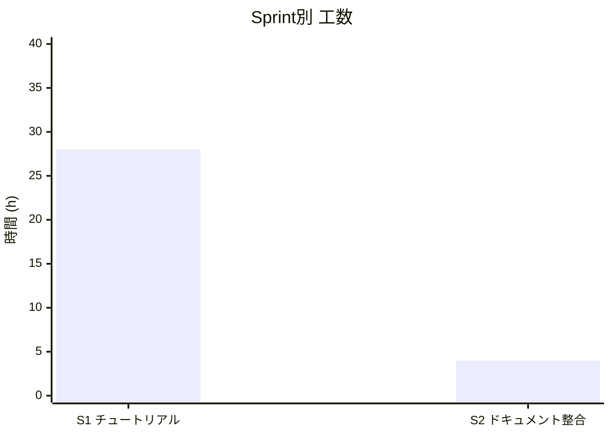
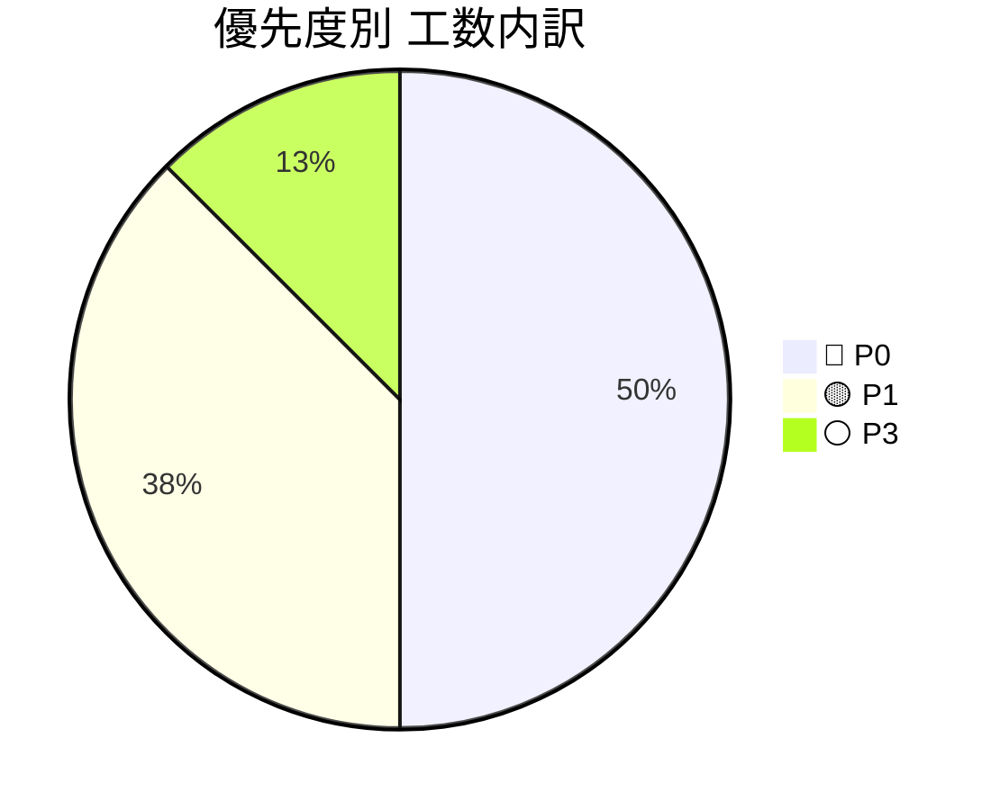
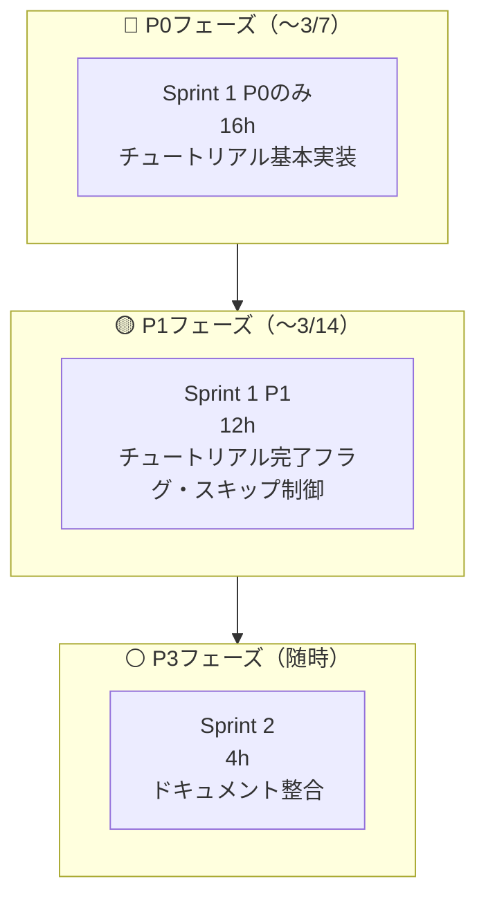

# 🚀 プロジェクトIssue管理テンプレート（工数見積もり付き）

---

## 📌 前提条件

* 想定チーム規模：3名（A・B・C）
* 見積単位：

  * XS = 2h
  * S = 4h
  * M = 8h
  * L = 16h
  * XL = 24h以上
* 優先度ラベル：

  * 🔴 P0：MVP必須
  * 🟡 P1：早期追加
  * 🟢 P2：中期対応
  * ⚪ P3：将来構想

## 3月 スケジュール

A:わしじゃよ
B:メギト
C:とばくろ

| 凡例 | 内容 |
|------|------|
| ○ | 作業可能(5時間) |
| △ | 作業可能(2～3時間) |
| × | 作業不可 |

| 日 | 月 | 火 | 水 | 木 | 金 | 土 |
|:---:|:---:|:---:|:---:|:---:|:---:|:---:|
|  |  |  |  |  |  | **1** A: × B: △ c: ×|
| **2** A: × B: ○ c: 〇 | **3** A: × B: ○ c: × | **4** A: × B: △ c: 〇 | **5** A: × B: △ c: 〇 | **6** A: × B: △ c: 〇 | **7** A: × B: ○ c: × | **8** A: × B: ○ c: × |
| **9** A: ○ B: ○ c: 〇 | **10** A: ○ B: ○ c: × | **11** A: ○ B: ○ c: 〇 | **12** A: ○ B: ○ c: 〇 | **13** A: ○ B: ○ c: 〇 | **14** A: ○ B: ○ c: × | **15** A: ○ B: ○ c: × |
| **16** A: ○ B: ○ c: 〇 | **17** A: ○ B: ○ c: × | **18** A: ○ B: ○ c: × | **19** A: ○ B: ○ c: × | **20** A: ○ B: ○ c: 〇 | **21** A: ○ B: × c: × | **22** A: ○ B: ○ c: × |
| **23** A: ○ B: ○ c: 〇 | **24** A: ○ B: ○ c: × | **25** A: ○ B: ○ c: 〇 | **26** A: △ B: △ c: 〇 | **27** A: ○ B: ○ c: 〇 | **28** A: ○ B: ○ c: × | **29** A: ○ B: ○ c: × |
| **30** A: ○ B: ○ c: 〇 | **31** A: ○ B: ○ c: × | | | | | |

---

# 🏁 実装タスク一覧（06_directory.md 差分ベース）

> 06_directory.md に定義されているが未実装のファイル・ディレクトリをもとに定義

---

## 🏗️ Sprint 1：チュートリアル機能

> `src/app/tutorial/` が丸ごと未実装

### 🔢 推定合計：28h

| #    | タイトル                                   | 工数 | 時間   | 優先度   | 担当  | 備考                              |
| ---- | ---------------------------------------- | -- | ------ | ----- | ----- | --------------------------------- |
| #001 | `types/tutorial.ts` — TutorialStep型定義   | XS | 2h    | 🔴 P0 | FE    | ステップID・タイトル・説明・遷移先を型定義           |
| #002 | `app/tutorial/page.tsx` — チュートリアル本体UI   | M  | 8h    | 🔴 P0 | FE    | ステップ表示・進捗バー・スキップボタン               |
| #003 | `app/tutorial/complete/page.tsx` — 完了ページ | S  | 4h    | 🔴 P0 | FE    | 完了メッセージ・ホームへの導線                   |
| #004 | `auth/signup/page.tsx` 修正 — 登録後 `/tutorial` へリダイレクト | XS | 2h | 🔴 P0 | FE | サインアップ完了フック内にリダイレクト追加 |
| #005 | チュートリアル完了フラグをSupabaseに保存               | M  | 8h    | 🟡 P1 | FE/BE | `profiles` テーブルに `tutorial_done` カラム追加 |
| #006 | 2回目以降のログイン時はチュートリアルをスキップ              | S  | 4h    | 🟡 P1 | FE    | `AuthContext` でフラグ確認しリダイレクト制御     |
|      | **Sprint 合計**                           |    | **28h** |      |       |                                   |
|      | **（P0のみ）**                             |    | **16h** |      |       |                                   |

---

## 🏗️ Sprint 2：06_directory.md ドキュメント整合

> mdの記載と実際のファイル名・構成が一部ずれているため整合する

### 🔢 推定合計：4h

| #    | タイトル                                                    | 工数 | 時間  | 優先度  | 担当 | 備考                                     |
| ---- | --------------------------------------------------------- | -- | ----- | ----- | ---- | ---------------------------------------- |
| #007 | `tikuribar/` 機能を06_directory.mdに追記                      | XS | 2h   | ⚪ P3  | -    | バーチャルバー機能がmdから完全に抜けているため追記              |
| #008 | `app/api/` に `news/` ルートをmd上に追記                         | XS | 1h   | ⚪ P3  | -    | 実際に存在するが06_directory.mdのapi配下から抜けている |
| #009 | `app/realction/fonts.ts` — コメント追記                       | XS | 1h   | ⚪ P3  | FE   | md上コメントなし。フォント定義の用途を明記                 |
|      | **Sprint 合計**                                           |    | **4h** |      |      |                                          |

---

# 📊 工数サマリー

## Sprint別工数

---

## 優先度別内訳

---

# 📈 規模感サマリー表

| 区分     | Issue数 | 工数合計 | 並行3名想定         |
| ------ | ------ | ------ | ---------------- |
| 🔴 P0  | 4件     | 16h    | 約0.5週間（〜3/7頃）   |
| 🟡 P1  | 2件     | 12h    | 約0.5週間（〜3/14頃）  |
| ⚪ P3   | 3件     | 4h     | 空き時間で随時          |
| **合計** | **9件** | **32h** | **約1週間**        |

> ※ レビュー込みなら ×1.3 で **約42h / 約1.5週間** 想定

---

# 🗓️ フェーズ分解

