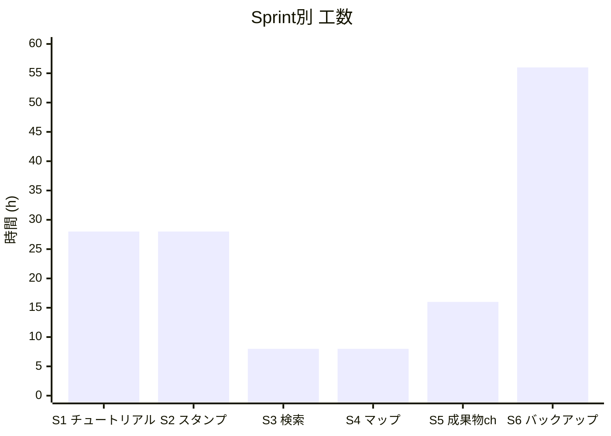
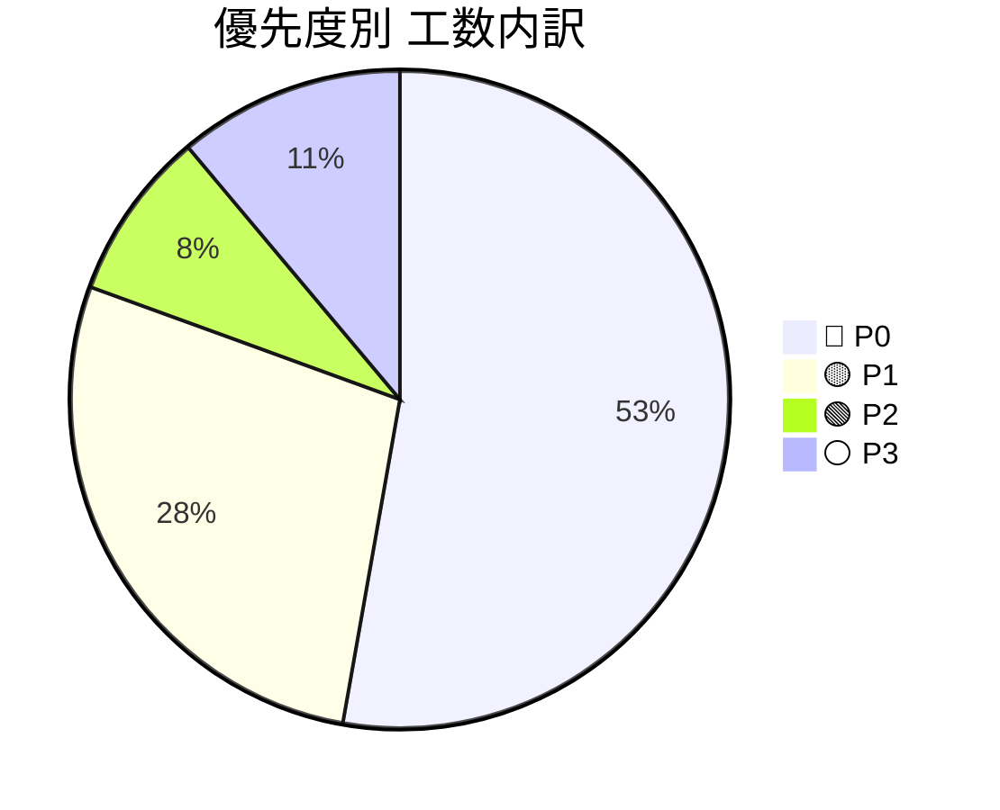
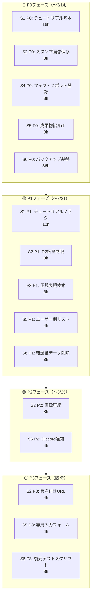

# 🚀 プロジェクトIssue管理テンプレート（工数見積もり付き）

---

## 📌 前提条件

- 想定チーム規模：3名（A・B・C）
- 見積単位：
  - XS = 2h
  - S = 4h
  - M = 8h
  - L = 16h
  - XL = 24h以上

- 優先度ラベル：
  - 🔴 P0：MVP必須
  - 🟡 P1：早期追加
  - 🟢 P2：中期対応
  - ⚪ P3：将来構想

## 🔎 直近の追記（2026-04）

- TikuriBar のフロント/アプリ機能と Supabase 側の `tikuribar_*` テーブル/ポリシーは削除済み。

## 3月 スケジュール

A:わしじゃよ
B:メギト
C:とばくろ

| 凡例 | 内容               |
| ---- | ------------------ |
| ○    | 作業可能(5時間)    |
| △    | 作業可能(2～3時間) |
| ×    | 作業不可           |

|               日                |               月               |               火                |                水                |               木                |               金               |               土               |
| :-----------------------------: | :----------------------------: | :-----------------------------: | :------------------------------: | :-----------------------------: | :----------------------------: | :----------------------------: |
|                                 |                                |                                 |                                  |                                 |                                | **1** A: × B: △ c: ×  |
| **2** A: × B: ○ c: 〇  | **3** A: o B: × c: ×  | **4** A: o B: × c: 〇  |  **5** A: o B: △ c: 〇  | **6** A: 0 B: 〇 c: 〇 | **7** A: o B: × c: ×  | **8** A: o B: ○ c: ×  |
| **9** A: x B: ○ c: 〇  | **10** A: ○ B: ○ c: × | **11** A: ○ B: × c: 〇 | **12** A: ○ B: △ c: 〇  | **13** A: ○ B: ○ c: 〇 | **14** A: ○ B: ○ c: × | **15** A: o B: ○ c: × |
| **16** A: ○ B: ○ c: 〇 | **17** A: x B: × c: × | **18** A: x B: × c: ×  |  **19** A: x B: × c: ×  | **20** A: ○ B: × c: 〇 | **21** A: ○ B: × c: × | **22** A: ○ B: ○ c: × |
| **23** A: ○ B: ○ c: 〇 | **24** A: ○ B: ○ c: × | **25** A: ○ B: ○ c: 〇 | **26** A: △ B: 〇 c: 〇 | **27** A: ○ B: × c: 〇 | **28** A: ○ B: ○ c: × | **29** A:o  B: × c: × |
| **30** A: ○ B: ○ c: 〇 | **31** A: ○ B: ○ c: × |                                 |                                  |                                 |                                |                                |

---

# 🏁 実装タスク一覧

---

## 🏗️ Sprint 1：チュートリアル機能

> `src/app/tutorial/` が丸ごと未実装

### 🔢 推定合計：28h

| #    | タイトル                                                        | 工数 | 時間    | 優先度 | 担当  | 備考                                             |
| ---- | --------------------------------------------------------------- | ---- | ------- | ------ | ----- | ------------------------------------------------ |
| #001 | `types/tutorial.ts` — TutorialStep型定義                        | XS   | 2h      | 🔴 P0  | FE    | ステップID・タイトル・説明・遷移先を型定義       |
| #002 | `app/tutorial/page.tsx` — チュートリアル本体UI                  | M    | 8h      | 🔴 P0  | FE    | ステップ表示・進捗バー・スキップボタン           |
| #003 | `app/tutorial/complete/page.tsx` — 完了ページ                   | S    | 4h      | 🔴 P0  | FE    | 完了メッセージ・ホームへの導線                   |
| #004 | `auth/signup/page.tsx` 修正 — 登録後 `/tutorial` へリダイレクト | XS   | 2h      | 🔴 P0  | FE    | サインアップ完了フック内にリダイレクト追加       |
| #005 | チュートリアル完了フラグをSupabaseに保存                        | M    | 8h      | 🟡 P1  | FE/BE | `profiles` テーブルに `tutorial_done` カラム追加 |
| #006 | 2回目以降のログイン時はチュートリアルをスキップ                 | S    | 4h      | 🟡 P1  | FE    | `AuthContext` でフラグ確認しリダイレクト制御     |
|      | **Sprint 合計**                                                 |      | **28h** |        |       |                                                  |
|      | **（P0のみ）**                                                  |      | **16h** |        |       |                                                  |

---

## 🏗️ Sprint 2：スタンプ機能（カテゴリA）

> Cloudflare R2 を用いた画像アップロード・管理機能

### 🔢 推定合計：28h

| #    | タイトル                               | 工数 | 時間    | 優先度 | 担当  | 備考                                                    |
| ---- | -------------------------------------- | ---- | ------- | ------ | ----- | ------------------------------------------------------- |
| #007 | A-1 スタンプ画像のR2アップロード実装a  | M    | 8h      | 🔴 P0  | FE/BE | `api/upload/` を利用し画像をR2へ保存                    |
| #008 | A-2 R2保存制限ロジック（10GB上限管理） | M    | 8h      | 🟡 P1  | BE    | 使用量を定期チェックし閾値超過時にアップロードを拒否    |
| #009 | A-3 アップロード前画像圧縮処理         | M    | 8h      | 🟢 P2  | FE    | sharp / Canvas API でリサイズ・圧縮してから送信         |
| #010 | A-4 パブリックURLを署名付きURLへ切替   | S    | 4h      | ⚪ P3  | BE    | R2 presigned URL を発行しパブリックエンドポイントを廃止 |
|      | **Sprint 合計**                        |      | **28h** |        |       |                                                         |
|      | **（P0のみ）**                         |      | **8h**  |        |       |                                                         |

---

## 🏗️ Sprint 3：検索系ロジック（カテゴリB）

> 正規表現による高度な投稿検索

### 🔢 推定合計：8h

| #    | タイトル                           | 工数 | 時間   | 優先度 | 担当  | 備考                                            |
| ---- | ---------------------------------- | ---- | ------ | ------ | ----- | ----------------------------------------------- |
| #011 | B-2 正規表現パターン検索機能の実装 | M    | 8h     | 🟡 P1  | FE/BE | 検索APIで正規表現受け取り・Supabaseクエリに変換 |
|      | **Sprint 合計**                    |      | **8h** |        |       |                                                 |

---

## 🏗️ Sprint 4：マップ機能（カテゴリC）

> 大学周辺おすすめスポット共有

### 🔢 推定合計：8h

| #    | タイトル                            | 工数 | 時間   | 優先度 | 担当  | 備考                                              |
| ---- | ----------------------------------- | ---- | ------ | ------ | ----- | ------------------------------------------------- |
| #012 | C-1 スポット登録・GoogleMap URL添付 | M    | 8h     | 🔴 P0  | FE/BE | 投稿フォームにGoogleMap URL入力欄を追加・DBに保存 |
|      | **Sprint 合計**                     |      | **8h** |        |       |                                                   |

---

## 🏗️ Sprint 5：成果物紹介ch（カテゴリD）

> 通常投稿とは分離した成果物専用チャンネル

### 🔢 推定合計：16h

| #    | タイトル                                 | 工数 | 時間    | 優先度 | 担当 | 備考                                                       |
| ---- | ---------------------------------------- | ---- | ------- | ------ | ---- | ---------------------------------------------------------- |
| #013 | D-1 成果物紹介ページ（専用投稿一覧表示） | M    | 8h      | 🔴 P0  | FE   | `/gallery` 等に専用ルートを作成し成果物のみ表示            |
| #014 | D-2 ユーザー別成果物リスト表示           | S    | 4h      | 🟡 P1  | FE   | プロフィールページに成果物タブを追加・簡易ポートフォリオ化 |
| #015 | D-4 成果物専用入力フォーム実装           | S    | 4h      | ⚪ P3  | FE   | タイトル・説明・使用技術・URL を入力できる専用フォーム     |
|      | **Sprint 合計**                          |      | **16h** |        |      |                                                            |
|      | **（P0のみ）**                           |      | **8h**  |        |      |                                                            |

---

## 🏗️ Sprint 6：データバックアップ・Raspberry Pi アーカイブ（カテゴリE）

> Supabase DB / R2 の容量を監視し、閾値超過時に自動で Raspberry Pi へ退避

### 🔢 推定合計：56h

| #    | タイトル                                    | 工数 | 時間    | 優先度 | 担当 | 備考                                                          |
| ---- | ------------------------------------------- | ---- | ------- | ------ | ---- | ------------------------------------------------------------- |
| #016 | E-1 DB / R2 容量監視スクリプト              | M    | 8h      | 🔴 P0  | BE   | `pg_database_size()` + R2 List API で定期チェック（cron）     |
| #017 | E-2 動的バックアップ起動判定ロジック        | S    | 4h      | 🔴 P0  | BE   | 閾値（env変数）超過時のみバックアップワーカーを起動           |
| #018 | E-3 データエクスポート・GPG暗号化・Pi転送   | XL   | 24h     | 🔴 P0  | BE   | JSON書出し → R2画像DL → tar圧縮 → GPG暗号化 → scp/rsync転送   |
| #019 | E-4 転送後データ削除・容量解放              | M    | 8h      | 🟡 P1  | BE   | Pi側チェックサム検証成功後に Supabase / R2 から対象データ削除 |
| #020 | E-5 バックアップ成否通知（Discord Webhook） | S    | 4h      | 🟢 P2  | BE   | 転送成功・失敗を Discord Webhook へ通知                       |
| #021 | E-6 復元テスト・検証スクリプト              | M    | 8h      | ⚪ P3  | BE   | GPG解除 → tar展開 → Supabaseへ試験インポート（年1回手動実行） |
|      | **Sprint 合計**                             |      | **56h** |        |      |                                                               |
|      | **（P0のみ）**                              |      | **36h** |        |      |                                                               |

---

# 📊 工数サマリー

## Sprint別工数

---

## 優先度別内訳

---

# 📈 規模感サマリー表

| 区分     | Issue数  | 工数合計 | 並行3名想定           |
| -------- | -------- | -------- | --------------------- |
| 🔴 P0    | 10件     | 76h      | 約2週間（〜3/14頃）   |
| 🟡 P1    | 6件      | 40h      | 約1週間（〜3/21頃）   |
| 🟢 P2    | 2件      | 12h      | 約0.5週間（〜3/25頃） |
| ⚪ P3    | 3件      | 16h      | 空き時間で随時        |
| **合計** | **21件** | **144h** | **約4〜5週間**        |

> ※ レビュー込みなら ×1.3 で **約187h / 約6週間** 想定

---

# 🗓️ フェーズ分解

